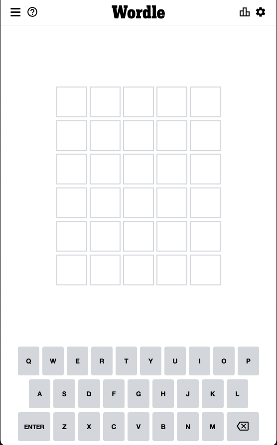
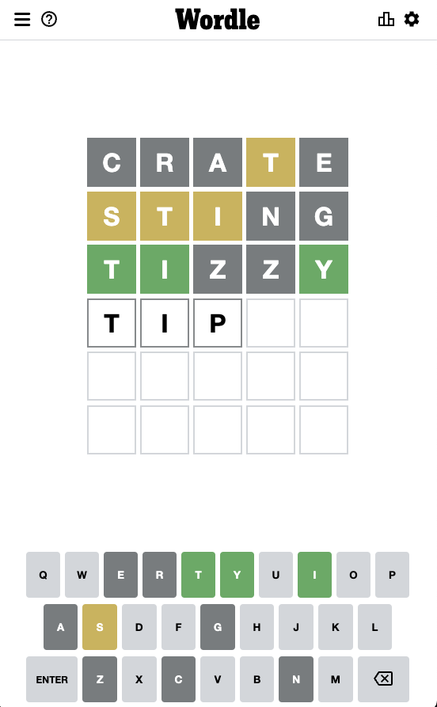
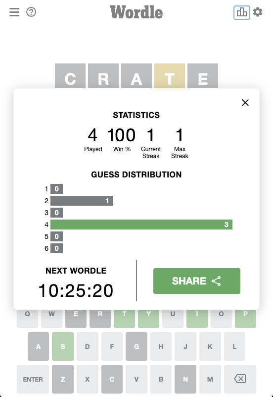

# Front End System Design Intervew: Wordle

In this exercise, you are going to use the mockup of the game Wordle (see below) and describe how we might create its interactive UI components.

### Objectives
- Explain the main UI components we will need
- Explain how these components are related (for example in a tree or hierarchy of components)
- Explain what state and props these components hold, and how data and functionality is shared between them.
- Explain the global state of the application. What pieces of data do multiple components need to know?
- As you consider each screen, feel free to revise your decisions based on earlier screens.

### _Not_ objectives

- We don't care about matching exactly how the real-life Wordle is implemented. There are many good ways to do this, and we're interested in _your_ solution.
- You do not need to design any back end services or APIs. If you think the front end needs a back-end service, you can assume it exists. Describe what it does and how your components communicate with it.
- We don't need to implement the logic for determining if a letter should be green or yellow, or for determining if a game is won or lost. You can assume that functions exist that do these things. You _might_ want to think about what data those functions would need.
- You do not need to get through all three screens to succeed.
- You do not need to be an expert in React, Redux, Context API, or any other framework and this exercise is not a test of framework knowledge.

## Screen mockups
### Initial screen

### Game in progress

### Post-game stats and share screen
